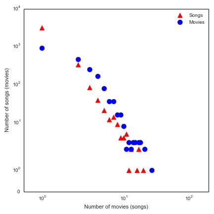
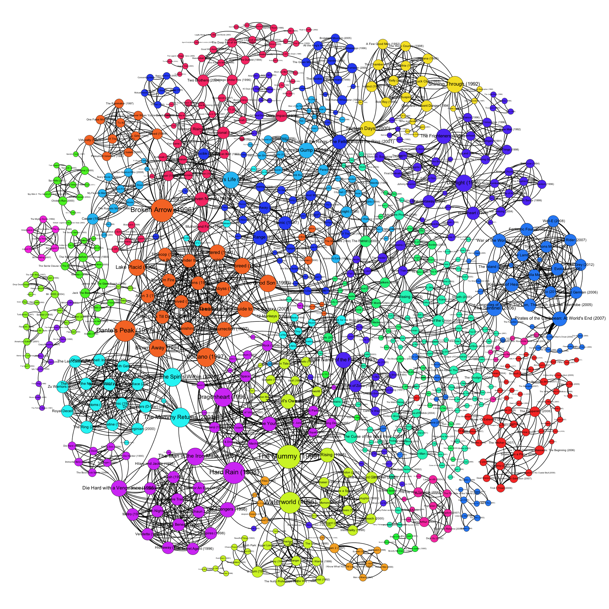
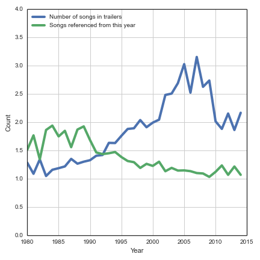
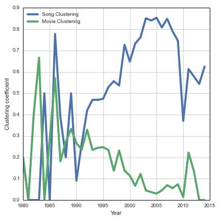
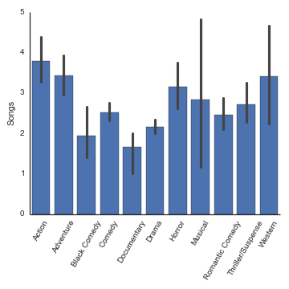
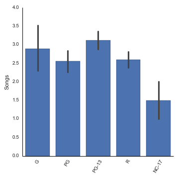
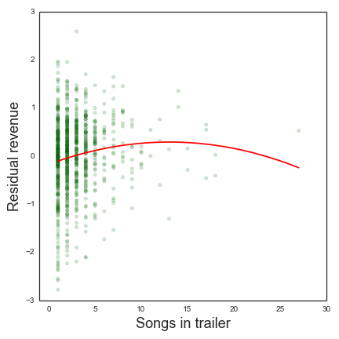

Trailers
========

I personally enjoy watching movie trailers. Sure they're just ads, but there's something about how the story is boiled down into two minutes and thirty seconds of dramatic cuts and exciting music. But I have also noticed that many movie trailers have a tendency to rely on similar songs and musical scores, even if these don't appear in the movie itself. For example, the recently released trailer for "If I Stay" features an ethereal electronic song.

I swore I had heard this song featured prominently before in another movie. Sure enough, it was also used in Andy and Lana Wachowski's "Cloud Atlas":

It turns out the song is named "Outro" by the French electronic group, M83. For me, this raised the question of how much do movie trailers share music in common? 

I used data gathered by [SoundTrack.net](http://www.soundtrack.net/trailers/) that identifies the music used in music trailers. I use data since 1980 to reflect the "modern" Hollywood era of commercial studios and blockbusters. While many types of trailers exist -- TV spots, teasers, internet, etc. -- I focus solely on the "full" theatrical trailers that run for approximately 2 minutes and 30 seconds. There are some caveats to these data as they are manually coded from user submissions and there is substantial variability in their coverage -- 161 movies are recorded in 2004 but only 35 in 2013. 

Like a social network of friends connected to friends, these data form a network of songs connected to movies. Some songs are used many times across multiple movies' trailers and some trailers contain multiple songs. Rather than being normally distributed, the number of trailers using a particular song and the number of songs in a particular trailer are both extremely skewed "[long tail](http://en.wikipedia.org/wiki/Long_tail)" distributions. There are thousands of trailers that use only a single song and a handful of trailers that use more than a dozen. There are likewise thousands of songs that are used only once but a handful of songs that are used up to 20 times.

Looking at the network of movies connected to other movies if they share a song in common, it's remarkable to see that 35% of movies released over the past 3 decades in these data are indirectly connected together by sharing common songs in their trailers. Put another way, there's a "[small world](http://en.wikipedia.org/wiki/Small-world_network)" effect where movie trailers are on average 5.34 songs in common away from any other movie trailer. We can look at what this network of movies connected by songs and see a remarkably complex and inter-connected structure of movies connected to other movies if they share a song in their theatrical trailer.

It's actually remarkable to think that some movie trailers are able to cram in nearly 20 different songs into a 150-second clip. I've tried to watch and listen to a few of these trailers, but I admit I had a hard time counting more than a dozen.

Movie | Year | Songs
--- | --- | ---
Resident Evil: Extinction | 2007 | 27
The Hitcher | 2007 | 21
Trick 'r Treak | 2009 | 21
Elektra | 2005 | 18
Hulk | 2003 | 18
Cry Wolf | 2005 | 18

Conversely, some songs are incredibly popular and used across more than a dozen different movie trailers. Some you would recognize immediately and were created by noted composers for other movies, others are much more subtle and designed specifically as trailer music. Interestingly enough, there is an [entire specialized industry](http://www.filmscoremonthly.com/features/beal.asp) of music scoring composers, companies, and libraries dedicated solely to producing music for movie trailers!

Song | Composer | Movies
--- | --- | ---
Aliens | James Horner | 20
Redrum | Immediate Music | 17
Tightwire | Immediate Music | 17
Ode to Power | Immediate Music | 16
Come See the Paradise | Randy Edelman | 13
Naked Prey | Immediate Music | 13

Looking at the movies released year by year, it is possible to track the average number of songs used in trailers that year as well as which year's songs get referenced the most. There's a tendency for the average trailer to become more complex in their musical scores by incorporating more songs over time. There was an average of just over one song per trailer through the 1980s, rising to over two songs per trailer by 2000, and peaking at an average of three in 2005 before falling back to 2 songs per trailer after 2010. I like to think of this as the "[Inception](https://www.youtube.com/watch?v=d3A3-zSOBT4)" effect where the single score with a dramatic "WHOOONG" bass note in 2010s trailers has replaced the more frenetic scores with a dozen songs found in mid-2000s [Harry Potter trailers](https://www.youtube.com/watch?v=PFWAOnvMd1Q), for example.

There's also a "nostalgia" effect where older songs are used in more trailers: songs from the 1980s are referenced twice on average by all subsequent trailers while songs from the 2000s are referenced just over once by subsequent trailers. Popular songs used in many trailers come from the late 1980s and early 1990s such as Aliens (20), [Backdraft](https://www.youtube.com/watch?v=Kg1IjbIBXZQ) (11), and [Dragon: The Bruce Lee Story](https://www.youtube.com/watch?v=FLn2XswCcrw) (9) while. Of course, there are also many standards from classical music canon such as "O Fortuna" from "[Carmina Burana](https://www.youtube.com/watch?v=GD3VsesSBsw)" (11) or Beethoven's [9th Symphony](https://www.youtube.com/watch?v=t3217H8JppI) (9) also included which obviously predate the 1990s but aren't shown in the chart.

Returning back to the network concept of songs connected to movies, how has the tendency for songs and movies to cluster together changed over time? This question can be answered two different ways: "do songs tend to share movies in common with other songs over time?" and "do movies tend to share songs in common with other movies over time?" There is another interesting divergence here: since 1990, songs in trailers are increasingly used in conjunction with each other. This suggests a narrowing of repertoire and more intense use of a subset of reliable and evocative songs together. However, with more and more movies each year, fewer of these movies share all their songs in common.

Are there differences between directors in their use of songs in movie trailers? Grouping the movies by their director and then selecting only those directors who have 5 or more movies in the corpus, we can compare directors who like frenetic trailer scores to those who like simple trailer scores.

Director | Films in data | Average songs per trailer
--- | --- | ---
Sam Raimi | 5 | 6.6
Robert Zemeckis | 5 | 6.2
Gore Verbinski | 6 | 5.67
And & Lana Wachowski | 5 | 5.6
Michael Bay | 7 | 3.85
Ron Howard | 7 | 3.85

Director | Films in data | Average songs per trailer
--- | --- | ---
Chris Columbus | 5 | 1.2
James Foley | 5 | 1.2
Dennie Dugan | 5 | 1.4
Joel Schumacher | 7 | 1.57
Paul Verhoeven | 5 | 1.6
Brian Robbins | 5 | 1.8

How does the number of songs per trailer vary across genres? Looking at differen genres of movies (as classified by [The-Numbers.com](http://www.the-numbers.com)), there are some significant differences. Action, adventure, and western films contain more than 3 songs per trailer on average while black comedy and documentary trailers have fewer than 2 on average. 

How does the number of songs per trailer vary by the movie's MPAA rating? There's less evidence of significant differences in the variation we observe here. G and PG13 movies have marginally more songs per trailer than PG or R movie trailer, while NC-17 movies (rare as they are) contain only 1.5 on average.

Finally, is there a relationship between the number of songs in a trailer and the revenue of a movie? Here, I model the relationship between movie revenue and the number of songs in its trailer, while controlling for a number of other explanatory variables such as movie budget, genre, rating, year, IMDB community rating, and Metascore from movie critics. The multiple linear regression model I used explained over 50% of the variance in the data, which is pretty good. The model estimated that each additional song within a trailer had a statistically significant effect (p < .001) of increasing the revenue of a movie by 4%. This suggests that trailers with complex scores involving many songs excite audiences more, which translates into higher box office receipts. However, there's obviously a limit to how much an audience can tolerate or a trailer editor can splice into 150 seconds, so there also has to be a penalty for having many songs. Adding a quadratic term on songs, there's a statistically significant (p < .05) negative effect suggesting a concave function. This suggests more trailer songs translates into more revenue up until 10 songs, then it starts to fall again.

